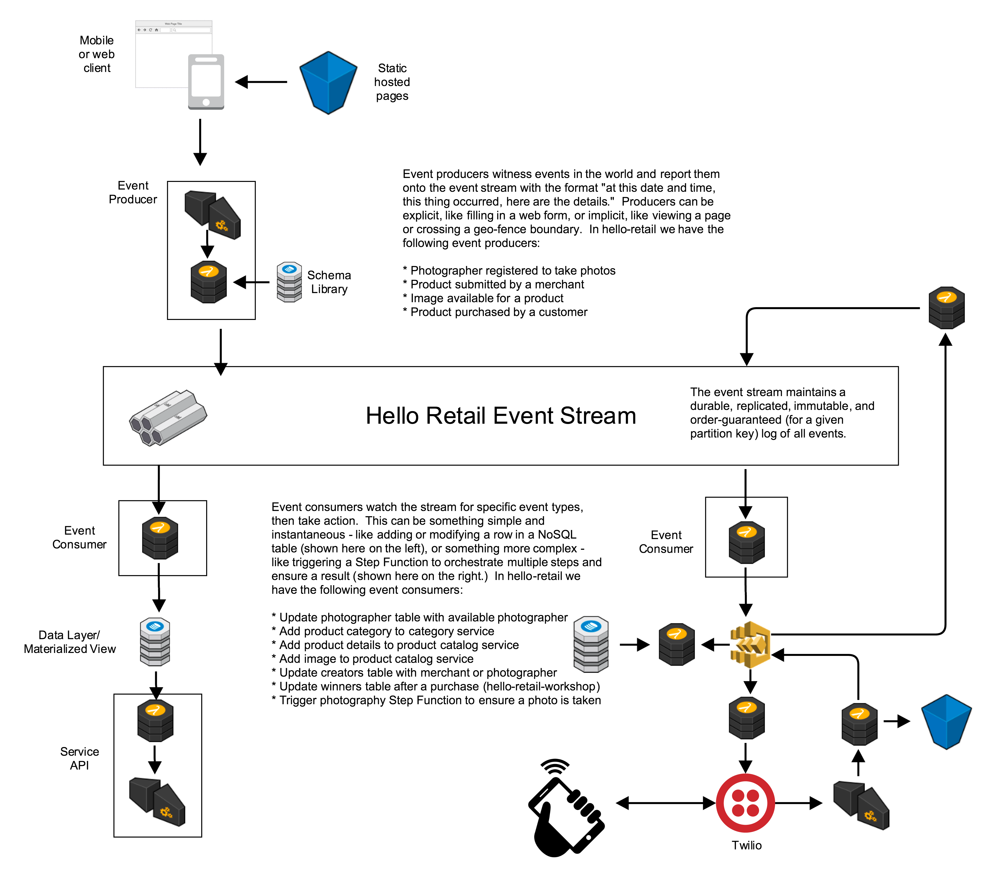
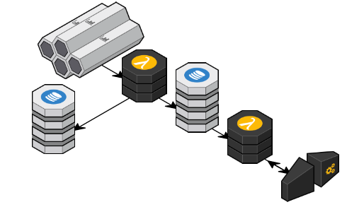

# Hello, Retail! The workshop.

This github repository is an open-source workshop intended to accompany the core funcitonal code in https://github.com/Nordstrom/hello-retail. For the workshop portion, participants take part in an interactive exercise playing the roles of merchants, pohotgraphers, and customers using hello-retail core.  After that, you extend it using this workshop to calculate the winning photographer and merchant.

### TL;DR:
Hello, Retail! is a Nordstrom Technology open-source project. Hello, Retail! is a 100% serverless, event-driven framework and functional proof-of-concept showcasing a central unified log approach as applied to the retail problem space. All code and patterns are intended to be re-usable for scalable applications large and small.

## Hello, Retail! core explained - an event-centric, serverless architecture

## Technologies used for this workshop
* **AWS Lambda** One way of thinking about it is 'functions as a service.'
* **AWS Kinesis** The stream.  Technically a durable replicated log.
* **AWS API Gateway** A fully-managed web-service front-end.  Resources, methods, authentication.  Trigger lambdas to do the work.
* **AWS DynamoDB** NoSQL tables.  Used here as a simple key-value store.
* **Serverless.com Framework** is an open source project with lots of handy tools to manage serverless configurations, shared code, and deploy your work to AWS.

## Why?
Serverless architectures offer incredible promise to reduce code complexity, operations costs, improve scalability, and when used correctly, security.  When you go serverless, you quickly realize the power of event-driven architectures.  These architectures are impedance matched with stateless, event-driven AWS Lambda functions and AWS Step Functions fully managed state machines.  A complete systems architecture that takes advantage of a unified central log/stream has benefits to extensibility, simplicity, backup and restore, and databases-as-cattle.  This project attempts to explore and prove out some of these concepts in a production-ready and scalable format.

## What you'll build in this workshop

In this diagram we see a lambda consuming from the stream and populating two DynamoDB tables.  The first keeps track of which merchants and photographers are associated with which products.  The second table maintains a tally of sales per merchant and sales per photographer.  The web service that is exposed through API Gateway invokes a lambda that reads from this aggregated view.

## What does all of this cost?
* AWS Lambda charges based on both the number of invocations and the duration of each function. For simple functions like these, assume about $.20 per million invocations.
* AWS API Gateway is about $3.50 per million calls.
* AWS DynamoDB for up to 5TPS in this example should cost less than $4 a month.

So, if we had 10,000,000 events a day (~200 events per second peak) and 1,000 reads from the web service, we'd expect about $2 in Lambda, $.0035 in API Gateway, and $10 a day in DynamoDB.

## Kudos!
* Huge props and all credit for the hello-retail code is due to Erik Erikson, Greg Smith, and Lauren Wang - the developers behind all of this code.
* Clearly, special thanks are due to Austen Collins and the rest of the crew at Serverless, Inc. who gave us the Serverless Framework, sparked our imaginations, and saved us a lot of pain.  Being in production with serverless architecture and staying sane requires a deployment framework, our pick is the Serverless.com Framework.
* Finally, thanks to all the good people at AWS losing sleep so we don't have to. ;)

## We humbly request your thoughts and feedback
All feedback is welcomed - so don't be shy!
